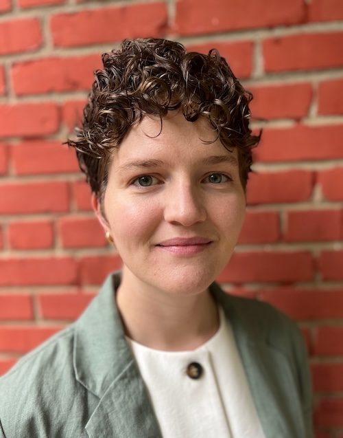

---
# Feel free to add content and custom Front Matter to this file.
# To modify the layout, see https://jekyllrb.com/docs/themes/#overriding-theme-defaults

layout: home
---
I am a historian and food studies scholar with a focus on labor and consumer cultures in the nineteenth- and twentieth-century United States. I am incoming Southern Foodways Alliance Assistant Professor of Southern Studies and Assistant Professor of History at the University of Mississippi. In 2025, I earned a PhD in History at Johns Hopkins University. My current work examines how people engaged in food production, distribution, and service service built alliances, unions, and associations to advocate for rights as workers and as citizens at the same time urban, middle-class consumers grew increasingly ambivalent and occasionally hostile towards workers in food-related trades. My dissertation, "Modern Fare: Labor, Consumption, and the Rise of the U.S. Food System, 1886-1906," focused on Chicago and drew extensively from sources generated around the 1893 World's Fair.
  
Also a student of the digital humanities, I am interested in critical, post-colonial, and Black DH applied to textual editing, sustainable design (minimal computing), and pedagogy.

